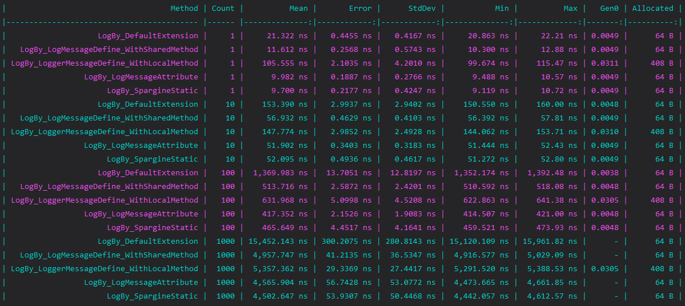
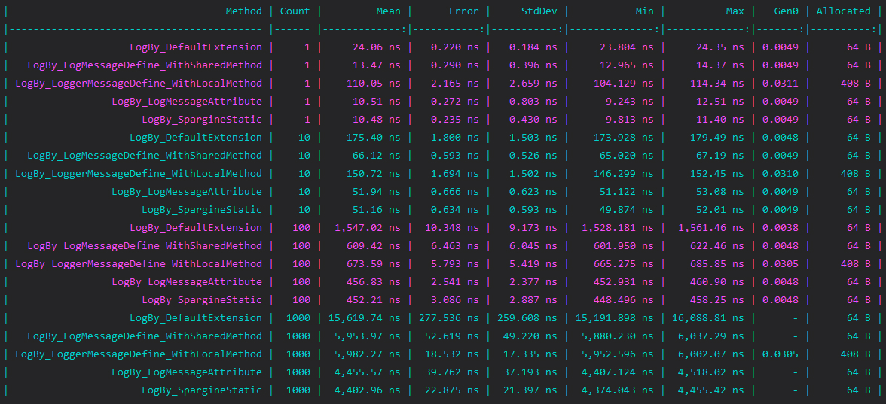

# DotNet.Logger.Benchmark

Testing the execution efficiency of different Log methods in various versions of .Net, including .Net 5 through .Net 7.

Reference:
- https://www.c-sharpcorner.com/article/speed-up-logging-in-net/
- https://learn.microsoft.com/en-us/dotnet/core/extensions/logger-message-generator

## Start with the conclusion 
- Use `LoggerMessage.Define<>` Instead of `Logger.Log()`.
- Use `LoggerMessageAttribute` Instead of `LoggerMessage.Define<>`.

In general, `LoggerMessage` is the **winner** all around. As we can see, using `LoggerMessage` in different .Net versions results in significantly faster execution times, which in turn leads to better performance in the StdDev aspect relative to using Logger Extension.

Moreover, starting from .Net 6, the performance of `LoggerMessageAttribute` is even better than `LoggerMessage.Define<>`.

## .Net 5

``` ini

BenchmarkDotNet=v0.13.1, OS=Windows 10.0.22621
12th Gen Intel Core i7-12700, 1 CPU, 20 logical and 12 physical cores
.NET SDK=7.0.203
  [Host]     : .NET 5.0.17 (5.0.1722.21314), X64 RyuJIT
  DefaultJob : .NET 5.0.17 (5.0.1722.21315), X64 RyuJIT
```


## .Net 6

``` ini
BenchmarkDotNet=v0.13.5, OS=Windows 11 (10.0.22621.1555/22H2/2022Update/SunValley2)
12th Gen Intel Core i7-12700, 1 CPU, 20 logical and 12 physical cores
.NET SDK=7.0.203
  [Host]     : .NET 6.0.16 (6.0.1623.17311), X64 RyuJIT AVX2
  DefaultJob : .NET 6.0.16 (6.0.1623.17311), X64 RyuJIT AVX2
```

## .Net 7

``` ini
BenchmarkDotNet=v0.13.5, OS=Windows 11 (10.0.22621.1555/22H2/2022Update/SunValley2)
12th Gen Intel Core i7-12700, 1 CPU, 20 logical and 12 physical cores
.NET SDK=7.0.203
  [Host]     : .NET 7.0.5 (7.0.523.17405), X64 RyuJIT AVX2
  DefaultJob : .NET 7.0.5 (7.0.523.17405), X64 RyuJIT AVX2
```

